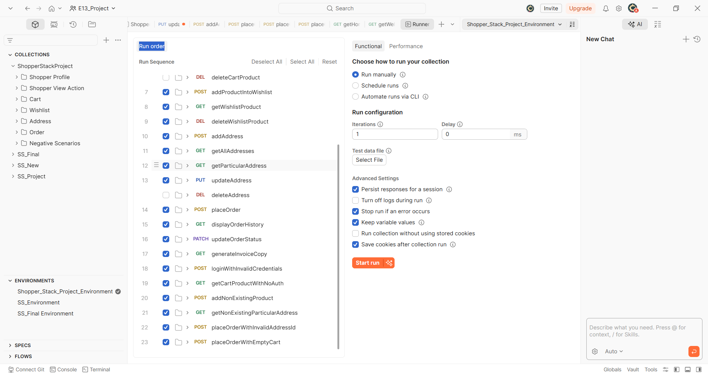
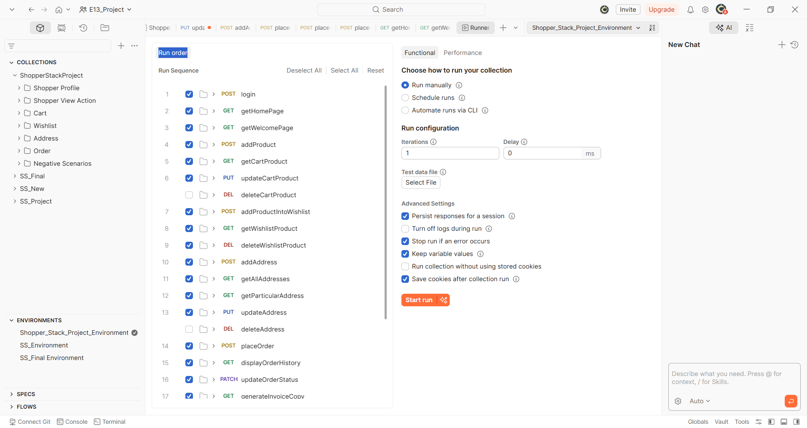
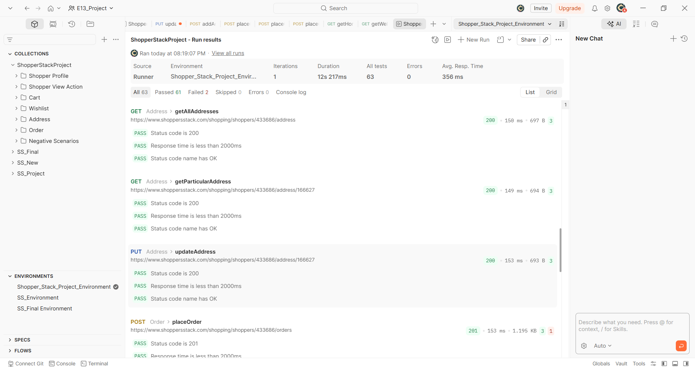
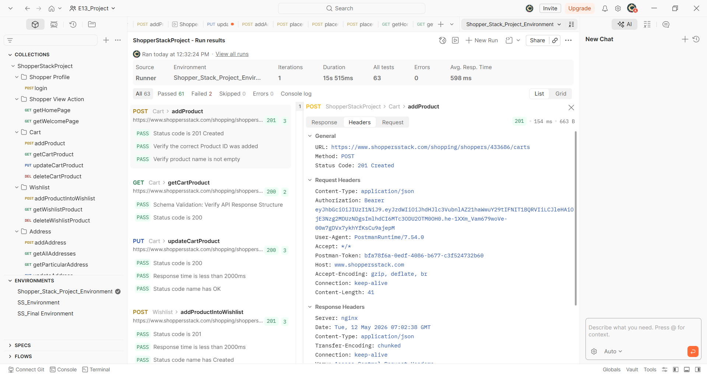
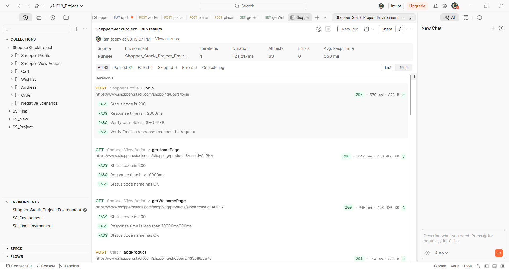
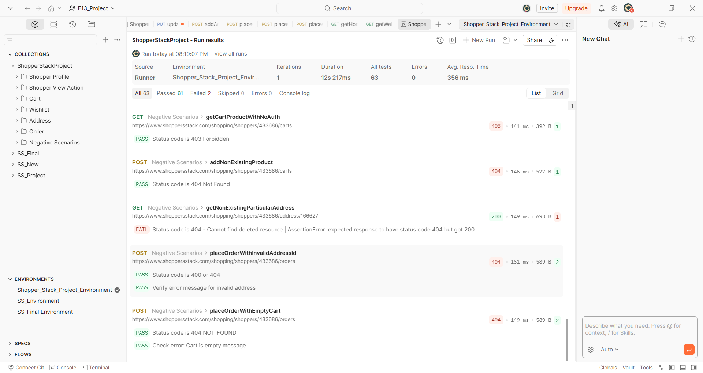
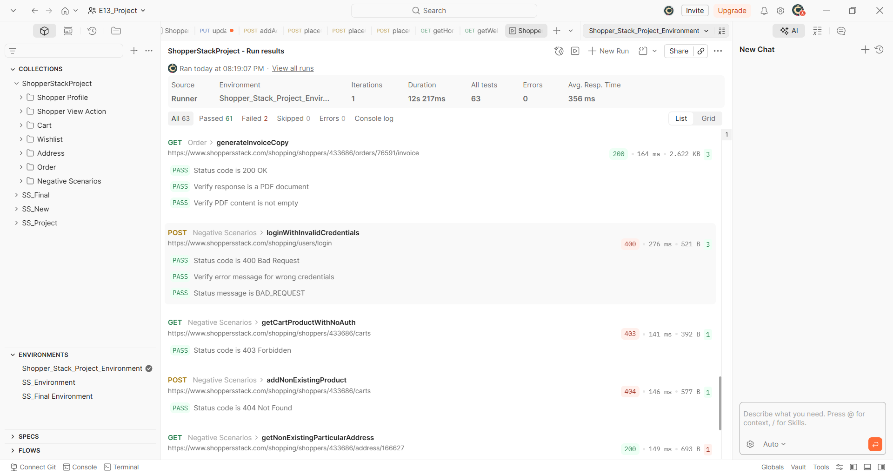
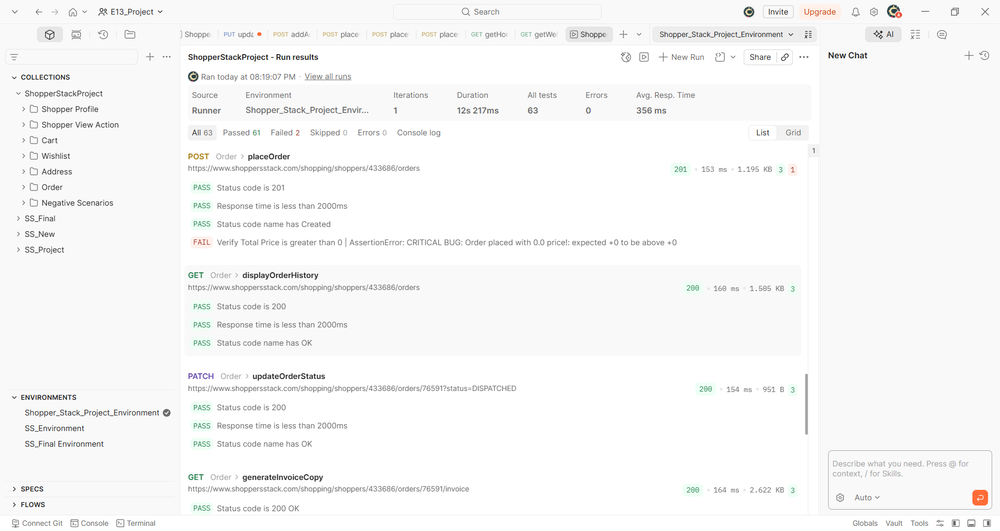

# ShopperStack API Automation Project

> End-to-end API testing suite for the ShopperStack e-commerce platform with bug detection and performance monitoring.

---

## 📌 Project Overview

This project automates the validation of ShopperStack's backend REST APIs — covering user authentication, product browsing, cart management, wishlist, address management, and order placement. Built using **Postman Collection Runner** with JavaScript test assertions and environment-based token chaining.

- **Total Tests:** 63
- **Passed:** 61
- **Failed:** 2 (intentional bug caught — critical price validation failure)
- **Avg. Response Time:** 356ms

---

## 🛠️ Tech Stack

| Tool | Purpose |
|------|---------|
| Postman | API test design, scripting, and execution |
| Postman Collection Runner | Running all requests in sequence automatically |
| JavaScript | Pre-request scripts and pm.test() assertions |
| Postman Environments | Managing baseUrl, authToken, and dynamic variables |
| Git & GitHub | Version control and project hosting |

---

## 📂 Folder Structure

```
ShopperStack-API-Automation-Project/
├── images/                        # Screenshots and proof of execution
├── README.md                      # Project documentation
```

---

## ▶️ How to Run the Collection in Postman

Follow these steps exactly to run the full test suite:

**Step 1 — Import the Collection**
1. Open Postman
2. Click **Import** (top left)
3. Upload the collection JSON file

**Step 2 — Set Up the Environment**
1. Click the **Environments** tab on the left sidebar
2. Select **Shopper_Stack_Project_Environment**
3. Make sure `baseUrl` and any required tokens are set
4. Click the environment dropdown (top right) and select it

**Step 3 — Open Collection Runner**
1. Right-click on **ShopperStackProject** collection in the left sidebar
2. Click **Run collection**
3. The Runner screen will open showing all requests in sequence

**Step 4 — Configure the Run**
1. Keep **Iterations** as `1`
2. Keep **Delay** as `0 ms`
3. Make sure **Keep variable values** is checked ✅ (important for token chaining)
4. Make sure **Persist responses for a session** is checked ✅
5. Do NOT check **Stop run if an error occurs** (so all tests run even if one fails)

**Step 5 — Start the Run**
1. Click the orange **Start run** button
2. Postman will execute all requests in order and show PASS / FAIL for each assertion
3. View results in the **List** or **Grid** tab after completion

---

## 📸 Screenshots

### 1. Collection Folder Structure

> ShopperStackProject collection organized into folders: Shopper Profile, Shopper View Action, Cart, Wishlist, Address, Order, and Negative Scenarios

### 2. Collection Runner Setup

> Runner configured with run sequence, iterations set to 1, Keep variable values enabled, and Start run ready

### 3. Positive Flow — Full Run Summary (Login → Cart → Order)

> Complete positive flow starting from login through cart operations to order placement — all assertions passing

### 4. Request Chaining in Action

> Auth token captured from login and automatically passed to Cart and Wishlist requests via environment variables — 63 tests, 61 passed, avg 598ms

### 5. Schema Validation Pass

> Address and Order endpoints passing schema structure validation, status code, and response time assertions

### 6. Negative Testing Results — Part 1

> Negative scenarios: 403 Forbidden for unauthorized cart access, 404 for non-existing product, invalid address order rejection — all correctly handled

### 7. Negative Testing Results — Part 2

> Further negative tests: invalid login credentials returning 400 Bad Request, empty cart order rejection with 404 NOT_FOUND

### 8. 🐛 Critical Bug Caught — Zero Price Order

> **CRITICAL BUG DETECTED:** `placeOrder` returns status 201 Created but total price is 0.0 — order placed successfully with zero price, which is a billing logic failure. AssertionError: expected +0 to be above +0

---

## ✅ APIs Tested

| Method | Endpoint | Description |
|--------|----------|-------------|
| POST | /shopping/users/login | User login & token generation |
| GET | /shopping/products?zoneId=ALPHA | Get home page products |
| GET | /shopping/products/alpha?zoneId=ALPHA | Get welcome page |
| POST | /shopping/shoppers/:id/carts | Add product to cart |
| GET | /shopping/shoppers/:id/carts | Get cart product |
| PUT | /shopping/shoppers/:id/carts | Update cart product |
| DEL | /shopping/shoppers/:id/carts | Delete cart product |
| POST | /shopping/shoppers/:id/carts (wishlist) | Add product to wishlist |
| GET | /shopping/shoppers/:id/wishlist | Get wishlist product |
| DEL | /shopping/shoppers/:id/wishlist | Delete wishlist product |
| POST | /shopping/shoppers/:id/address | Add address |
| GET | /shopping/shoppers/:id/address | Get all addresses |
| GET | /shopping/shoppers/:id/address/:aid | Get particular address |
| PUT | /shopping/shoppers/:id/address/:aid | Update address |
| POST | /shopping/shoppers/:id/orders | Place order |
| GET | /shopping/shoppers/:id/orders | Display order history |
| PATCH | /shopping/shoppers/:id/orders/:oid | Update order status |
| GET | /shopping/shoppers/:id/orders/:oid/invoice | Generate invoice copy |

---

## 🐛 Bug Detected

| Bug ID | Endpoint | Severity | Description |
|--------|----------|----------|-------------|
| BUG-01 | POST /orders | 🔴 Critical | Order placed successfully with total price = 0.0. Billing validation missing on server side. Expected price > 0 but got 0. |
| BUG-02 | GET /address/:id | 🟡 Medium | Deleted address still returns 200 OK instead of expected 404 Not Found. Resource not properly cleaned up after deletion. |

---

## 👤 Author

**Sunny Atre**
[GitHub Profile](https://github.com/Sunny-Atre)
